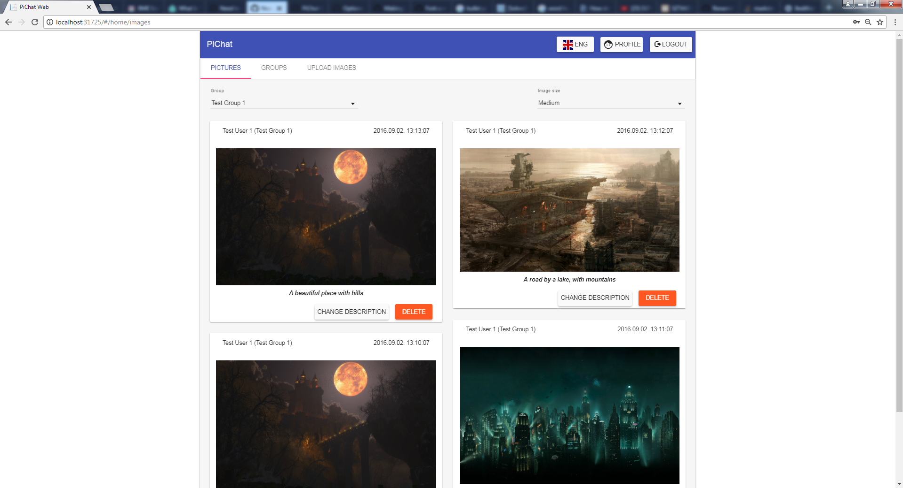
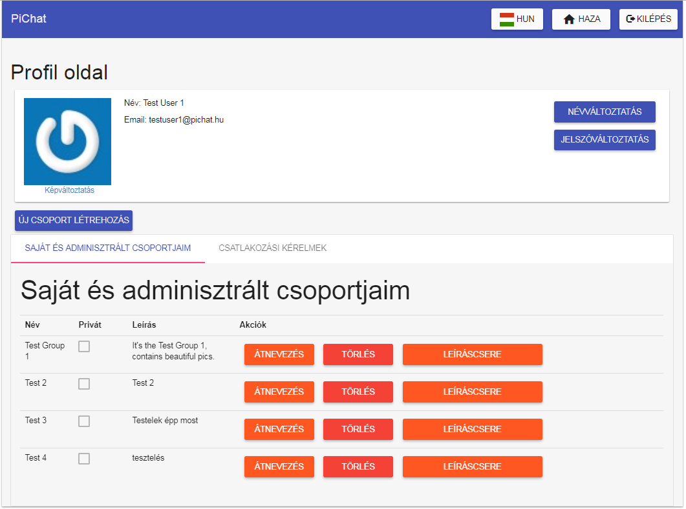
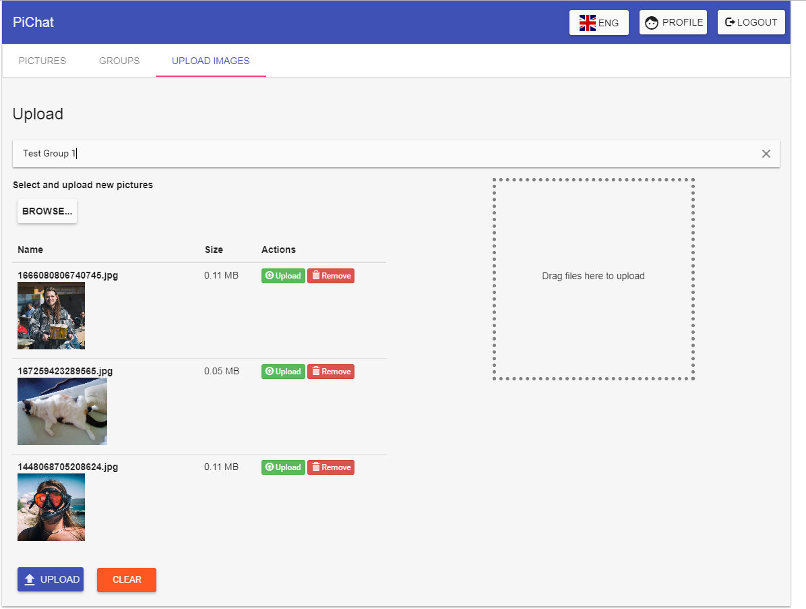
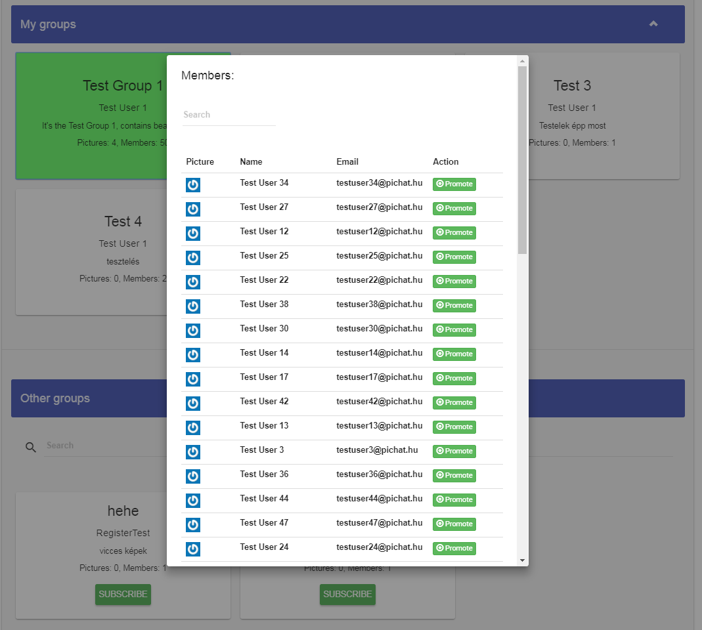

# PiChat-Git
Cloned from tfs.
This was the learning project at my first professional practice.   
Techs: Angular, Jquerry, Less, Signalr, gravatar, asp.net mvc, Entity framework  
Team members: Kovács Levente Ákos, Répassy Adrien, Márton Péter.  

PiChat is a web application, where people could create and join into private or public groups, in which they could share pictures.
 

# Screenshots:  
## View

## Profile

## Upload

## Memberlist

